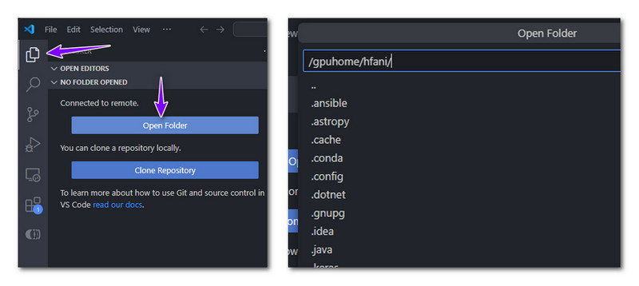
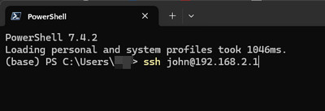
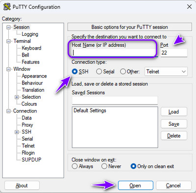
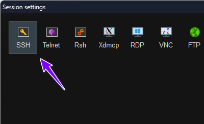
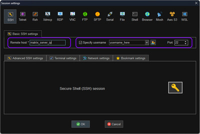
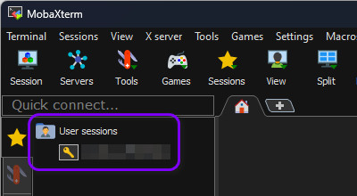

# Connecting to the Matrix (GPU) Server

This guide outlines some of the easiest ways to connect to the Matrix (GPU) server via SSH. However, the guide is written for Windows users but the setup experience is mostly similar on a Mac and Linux.

**Requirement**: You must have the **GlobalProtect VPN** installed and running/enabled to connect to the Matrix server.

## Ways to connect remotely via SSH

  - [Ways to connect remotely via SSH](#ways-to-connect-remotely-via-ssh)
    - [via Visual Studio Code (VSCode) using an extension](#via-visual-studio-code-vscode-using-an-extension)
    - [via Windows Terminal](#via-windows-terminal)
    - [via PuTTY](#via-putty)
    - [via MobaXterm](#via-mobaxterm)

### via Visual Studio Code (VSCode) using an extension

This is my favourite method as it's quite simple and as well as gives you the ability to view the server's directories in the same way you'd normally see your files in the file explorer panel in VSCode as if you're working locally.

1. In VSCode's extension market, search and install an extension called **Remote - SSH** by Microsoft
2. Once the extension is installed, click the two angled brackets at the bottom left corner of your VSCode
> 
3. Select **Connect to Host...** option from the list
> 
4. Select  **Add a New SSH Host...** option from the list
> 
5. Enter the credential in the format of `ssh username@MatrixServerIPAddress`. i.e., `ssh john@192.168.2.1` and press enter
> 
6. When a prompt asks whether to trust the connection, approve it
7. In subsequent connections, repeat steps 2-5.

Once connected, you can use the file explorer to select your base folder for this session by going to the explorer tab and selecting a directory as shown below.

**Benefit**: This method provides the closest experience to local development since all your development tools and extensions from VSCode are available.

### via Windows Terminal

1. Launch Windows Terminal (or search in the Start Menu and select **Terminal**)
2. Once the terminal is loaded, enter `ssh username@MatrixServerIPAddress`. i.e., `ssh john@192.168.2.1` and press enter
> 
3. On the next prompt, enter the Matrix server's password and press enter
4. In subsequent connections, repeat steps 2 and 3

### via PuTTY

[Download PuTTY - a free SSH and telnet client for Windows](https://putty.org/)

1. Launch PuTTY
2. In the Host Name box, enter the IP address and username in the format of `username@MatrixServerIPAddress` and keep port at 22 and connection type as SSH and click **Open**
> 
3. On the next prompt, enter the Matrix server's password and press enter

### via MobaXterm

[Download MobaXterm Xserver with SSH, telnet, RDP, VNC and X11](https://mobaxterm.mobatek.net/download.html)

1. Launch MobaXterm
2. Click **Session** near the top left of the menu
> 
3. Click **SSH** from the options list
> 
4. Enter **Remote host** (which is the Matrix server's IP address), check the box for **Specify username** and enter username
5. Leave port as **22**
6. Click **OK** to connect
> 
1. When asked to trust the identity on first connect, select **Accept**
2. On the next prompt, enter the Matrix server's password and press enter
3.  On subsequent connections, this SSH session should now be available under the **User sessions** panel

